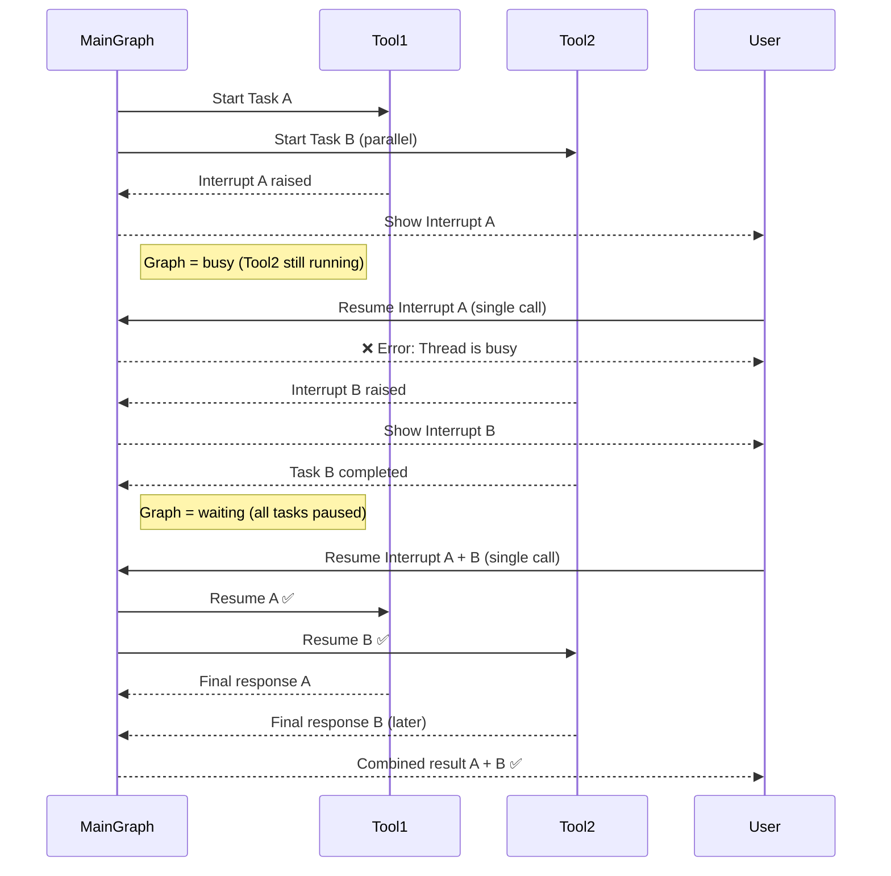

# Concurrent Interrupts with LangGraph

A LangGraph application demonstrating concurrent interrupt handling in agent workflows.

## Overview

This project demonstrates how LangGraph handles concurrent interrupts when multiple tools are running in parallel. The interrupts are sent using the **send API**, allowing tools to communicate their interrupt status back to the graph. The key insight is that when multiple tools are running concurrently and raise interrupts, the graph remains "busy" until all running tasks complete or are interrupted. Only then can interrupts be resumed.

### Flow Explanation

The diagram above illustrates the concurrent interrupt handling pattern:

1. **Parallel Execution**: Multiple tools (Task A and Task B) start running concurrently
2. **First Interrupt**: Tool1 raises an interrupt while Tool2 is still running
3. **Busy State**: The graph remains busy and cannot process resume requests
4. **Second Interrupt**: Tool2 also raises an interrupt  
5. **Waiting State**: Only after all tasks are paused/completed can interrupts be resumed
6. **Batch Resume**: Multiple interrupts can be resumed in a single call when the graph is in waiting state

### Sequence Diagram



## Prerequisites

- Python 3.11 or higher
- LangGraph CLI installed

## Setup

1. Install dependencies:
```bash
uv sync
```

2. Configure environment variables:
Create a `.env` file with your required environment variables (API keys, etc.)

## Running the Agent

### Option 1: Run with SDK (without API)
```bash
uv run src/agent.py
```

### Option 2: Run as LangGraph API

To start the LangGraph API server, run:

```bash
langgraph up
```

This command will:
- Load the configuration from `langgraph.json`
- Start the API server with the agent defined in `src/agent.py`
- Make the API available for handling concurrent interrupts

The API will be accessible at `http://localhost:8000` by default.

## API Testing

A Postman collection is included (`LangGraph Multiple Interrupts.postman_collection.json`) for testing the API endpoints.

## Project Structure

- `src/agent.py` - Main agent implementation with the `build_agent` function
- `langgraph.json` - LangGraph configuration file
- `.env` - Environment variables (create this file with your settings)